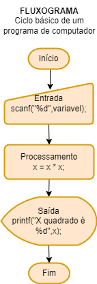

# Aula04 - (Continuação Fluxograma)
## Aula anterior. Fluxogramas
Representação gráfica de algoritmos
### Utilizade
Facilitar o entendimento de um programa ou processo de trabalho




## Lista de Exercícios 

- 1 Desenvolva um programa que leia a velocidade de um carro (km/h) e a distância a ser percorrida (km) por ele. Calcule e apresente na tela, quanto tempo (horas) será necessário para o carro percorrer a distância informada.
- 2 Desenvolva um programa que leia o nome e o salário de uma pessoa, depois leia o valor do índice percentual (%) de reajuste do salário. Calcule e apresente na tela, o valor do novo salário e o nome da pessoa.
- 3 Sabendo-se que a velocidade de cruzeiro de um avião 747-300 é de 900 km/h, faça um programa que leia uma distância (km), calcule e apresente na tela, quanto tempo (horas) será necessário para um 747-300 sobrevoar a distância informada.
- 4 Desenvolva um programa que leia o raio (cm) e a altura (cm) de um cilindro. Calcule e mostre a área (cm2) e o volume (cm3) do cilindro.
- 5 Desenvolva um programa que leia o nome e o preço de uma mercadoria. O programa deverá calcular um aumento de 5% no preço da mercadoria e mostrar o nome da mercadoria e o seu novo preço.
- 6 Desenvolva um programa que leia o nome de uma cidade, o número total de eleitores e o número total de votos apurados na última eleição. O programa deverá calcular e exibir a porcentagem de participação dos eleitores desta cidade na última eleição.

- **Obs**: Todas as entradas serão consideradas como valores inteiros e positivos, portanto o programa não precisará testá-las.

## CORREÇÕES

- Exercício 1:
```c
#include<stdio.h>
#include<locale.h>
	int main(){
	setlocale(LC_ALL,"");
	int velocidade;
	int distancia;
	
	printf("Digite a velocidade: ");
	scanf("%d", &velocidade);	
	
	printf("Digite a distância: ");
	scanf("%d", &distancia);
	
	printf("A sua velocidade é: %d", velocidade/distancia);
		
	return 0;}
```
- Exercício 2:
```c
include <stdio.h>
include <locale.h>
int main(){
	
	char nome[50];
	float salario, percentual, novo_salario;
	
	//Solicitar a entrada do nome da pessoa
	printf("Digite o nome da pessoa: ");
	scanf("%s", nome);
	
	//Solicitar a entrada do salario
	printf("Digite o salario da pessoa: R$");
	scanf("%f", &salario);
	
	//Solicitar o valor do percentual
	printf("Digite o valor do percentual: ");
	scanf("%f", &percentual);
	
	novo_salario = salario *(1+percentual/100);
	
	//Exibir nome da pessoa e o seu salario
	printf("Novo salario de %s: R$%.2f\n", nome, novo_salario); 
	
	return 0;}
```
- Exercício 3:
```c  
#include<stdio.h>
#include<locale.h>
int main(){
	setlocale(LC_ALL,"");
	int vitoria=3;
	int empate=1;
	int derrota=0;
	char nome_time[252];
	int qtd_empates;
	int qtd_vitorias;
	
	printf("Digite o nome do time de futebol: ");
	scanf("%s", nome_time);
	
	printf("Quantas vitórias o time obteve: ");
	scanf("%d", &qtd_vitorias);
	
	printf("Quantos empates o time obteve: ");
	scanf("%d", &qtd_empates);
	
	printf("O nome do time é: %s\n", nome_time);
	printf("O time obteve: %d\n", qtd_vitorias*vitoria, "vitórias!");
	printf("O time obteve: %d\n", qtd_empates*empate, "empates!");	
	return 0;}
```
- Exercício 4:
```c  
#include <stdio.h>
#include <math.h>
#include<locale.h>

int main() {
	setlocale(LC_ALL,"");
    float raio, altura, area_base, area_lateral, area_total, volume;
    float PI = 3.14159;

    // Solicita a entrada do usuário para o raio e a altura do cilindro
    printf("Digite o raio do cilindro (em cm): ");
    scanf("%f", &raio);

    printf("Digite a altura do cilindro (em cm): ");
    scanf("%f", &altura);

    // Calcula a área da base do cilindro (área do círculo)
    area_base = PI * pow(raio, 2);

    // Calcula a área lateral do cilindro
    area_lateral = 2 * PI * raio * altura;

    // Calcula a área total do cilindro
    area_total = 2 * area_base + area_lateral;

    // Calcula o volume do cilindro
    volume = area_base * altura;

    // Exibe a área e o volume do cilindro na tela
    printf("Área da base do cilindro: %.2f cm^2\n", area_base);
    printf("Área lateral do cilindro: %.2f cm^2\n", area_lateral);
    printf("Área total do cilindro: %.2f cm^2\n", area_total);
    printf("Volume do cilindro: %.2f cm^3\n", volume);

    return 0;}
```
- Exerício 5:
```c  
#include <stdio.h>
#include<locale.h>
int main() {
	setlocale(LC_ALL,"");
    char nome_mercadoria[50];
    float preco, novo_preco;

    // Solicita a entrada do usuário para o nome e o preço da mercadoria
    printf("Digite o nome da mercadoria: ");
    scanf("%s", nome_mercadoria);

    printf("Digite o preço da mercadoria: R$ ");
    scanf("%f", &preco);

    // Calcula o novo preço com o aumento de 5%
    novo_preco = preco * 1.05;

    // Exibe o nome da mercadoria e o novo preço na tela
    printf("Nome da mercadoria: %s\n", nome_mercadoria);
    printf("Novo preço da mercadoria: R$ %.2f\n", novo_preco);

    return 0;}
```
- Exercício 6:
```c  
#include <stdio.h>
#include<locale.h>
int main() {
	setlocale(LC_ALL,"");
    char nome_cidade[50];
    int total_eleitores, total_votos;
    float participacao;

    // Solicita a entrada do usuário para o nome da cidade, o número total de eleitores e de votos apurados
    printf("Digite o nome da cidade: ");
    scanf("%s", nome_cidade);

    printf("Digite o número total de eleitores da cidade: ");
    scanf("%d", &total_eleitores);

    printf("Digite o número total de votos apurados na última eleição: ");
    scanf("%d", &total_votos);

    // Calcula a porcentagem de participação dos eleitores na última eleição
    participacao = (float)total_votos / total_eleitores * 100;

    // Exibe a porcentagem de participação na tela
    printf("Porcentagem de participação dos eleitores de %s na última eleição: %.2f%%\n", nome_cidade, participacao);

    return 0;}
```
