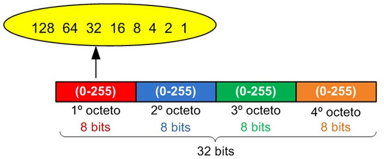
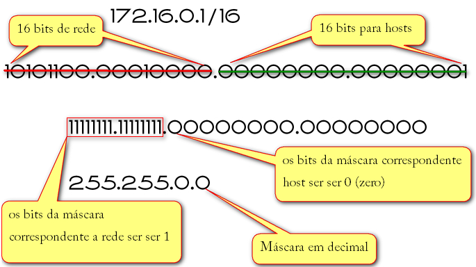

# Aula 10

- Mapeamento de Subrede
## Endereçamento IP
- Calculo de máscara de subrede

## 1ºExemplo

## 2ºExemplo

- Na imagem a seguir podemos notar 2 Octais totalmente preenchidos, e dois octais zerados ou seja, um total de 255^2 hosts liberados.

- A mascara sendo "16", em binário ficara igual na imagem: 255.255.0.0.
    - O Gatway ficara: 172.16.0.1.
    - Broadcast ficar: 172.16.255.255
    - E ficara em apenas 1 escopo, justamente porque a mascara é 16. Caso a mascara fosse 17, ja seriam 2 escopos, ou seja, dividido por 2:
        - 172.16.0.0 até 172.16.0.127
        - 172.16.0.128 até 172.10.0.255
## Atividade
### A partir das seguintes redes, encontre o total de hosts, gateway e broadcast
- a) 192.168.0.0/24
- b) 192.168.3.0/25
- c) 10.0.0.128/25
- d) 172.16.0.192/26
- e) 172.10.0.0/16
- f) 172.16.0.0/17
- g) 10.0.0.0/8
- h) 10.0.128.0/17
- i) 10.128.0.0/9