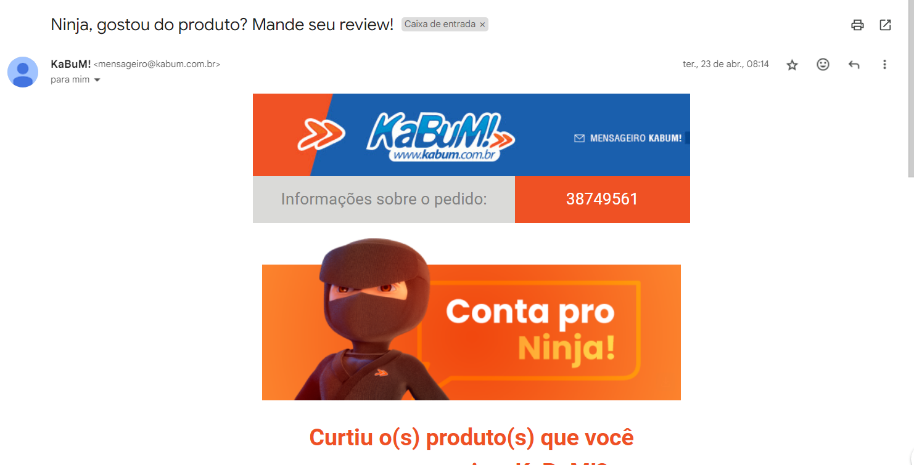
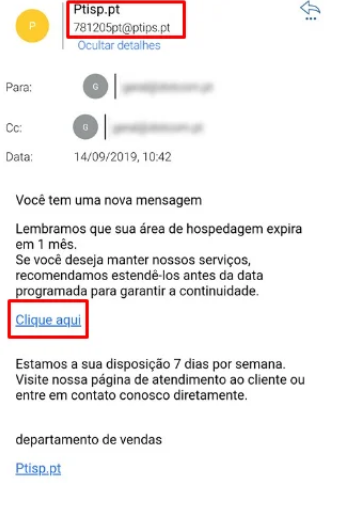

# Aula 11

|Exercício|
|-|
|Criar um programa em HTML, CSS e JS que cadastre todas as suas receitas e despesas, para a sua gestão financeira.||-| 
|RN001 - Linguagem HTML, CSS e JS|_Essencial_|
|RN002 - Programação estrutural e funcional|_Essencial_|
|**Funcionais**
|RF001 - Cadastrar Receitas e Despesas 1.Novo da Pessoa, 2. Receita, 3. Despesas , 4.Datas de Pagamento.|
|RF005 - Listar todos os cadastros calculando se estara positivo ou negativo no final do mês.|_Importante_|

## Segurança cibernética
    6.1. Definição
    6.2. Ameaças
    6.3. Vulnerabilidades
    6.4. Credenciais
    6.5. Engenharia Social
    6.6. Intervenções
    6.6.1.Proteção
    6.6.2.Prevenção

## Definição de Segurança Cibernética
- A definição de Segurança Cibernética refere-se ao conjunto de práticas, tecnologias, políticas e procedimentos projetados para proteger sistemas de computador, redes, dispositivos e dados contra ataques, danos, acesso não autorizado, roubo ou qualquer outra forma de intrusão digital. 

## Importância da Segurança Cibernética
- A importância da segurança cibernética reside no fato de que vivemos em uma era altamente digitalizada, onde quase todos os aspectos de nossas vidas estão interligados por meio de tecnologia. Desde informações pessoais e financeiras até infraestruturas críticas e sistemas governamentais, praticamente tudo está armazenado, transmitido e processado digitalmente.
### Breve História e Evolução da Segurança Cibernética:
- A história da segurança cibernética remonta aos primeiros dias da computação, quando os sistemas eram muito menos complexos e as ameaças eram menos sofisticadas. Aqui está uma breve visão geral da evolução da segurança cibernética:

- Década de 1970: Os primeiros sistemas de computador eram vulneráveis a ataques simples, como invasões de senha e vírus de computador rudimentares.

- Década de 1980: Com o aumento da conectividade entre sistemas, surgiram os primeiros worms e malware capazes de se espalhar pela rede.

- Década de 1990: O crescimento da internet trouxe consigo novos desafios de segurança, incluindo ataques de negação de serviço (DDoS) e o surgimento do crime cibernético organizado.

- Década de 2000: A segurança cibernética tornou-se uma preocupação global à medida que ataques cibernéticos de alto perfil, como o worm "I Love You" e os ataques de 11 de setembro, destacaram a vulnerabilidade de sistemas críticos.

- Década de 2010: O aumento do uso de dispositivos móveis, computação em nuvem e IoT introduziu novos vetores de ataque, enquanto regulamentações como o GDPR e o aumento da conscientização sobre segurança cibernética impulsionaram a adoção de melhores práticas de segurança.

- Década de 2020: A segurança cibernética tornou-se ainda mais complexa com o surgimento de ameaças como ransomware, ataques de supply chain e inteligência artificial aplicada a ciberataques, destacando a necessidade contínua de inovação e vigilância em segurança cibernética.

## Ameaças Cibernéticas:

- a) Malware: É um termo genérico que engloba vários tipos de software malicioso, como vírus, worms, trojans, ransomware e spyware.
- b) Phishing: É uma técnica usada por cibercriminosos para enganar usuários e obter informações confidenciais.
- c) Ataques de Negação de Serviço (DDoS): Nesses ataques, os hackers inundam um sistema, rede ou serviço com uma quantidade esmagadora de tráfego de dados.
- d) Ataques de Engenharia Social: Esses ataques exploram a psicologia humana para enganar as pessoas a divulgar informações confidenciais ou realizar ações prejudiciais.

## 2. Exemplos Reais de Ataques Cibernéticos e Suas Consequências:
- Ataque de Ransomware WannaCry em 2017: Este ataque infectou centenas de milhares de computadores em todo o mundo, criptografando seus dados e exigindo um resgate em Bitcoin para restaurá-los. Isso causou grandes interrupções em hospitais, empresas e serviços governamentais, resultando em perdas financeiras e danos à reputação.

- Ataque de Phishing à Equifax em 2017: Neste caso, os hackers exploraram uma vulnerabilidade no site da Equifax para obter acesso a informações pessoais de mais de 143 milhões de pessoas. Isso resultou em um dos maiores vazamentos de dados da história e teve sérias repercussões para a empresa e seus clientes.

- Ataque DDoS à Dyn em 2016: Este ataque mirou o provedor de serviços de DNS Dyn, causando interrupções em grandes sites como Twitter, Netflix e Amazon. O ataque destacou a vulnerabilidade da infraestrutura de internet centralizada e ressaltou os riscos associados aos ataques DDoS.

## O que são Vulnerabilidades Cibernéticas
- Vulnerabilidades cibernéticas referem-se a fraquezas ou falhas em sistemas de computador, redes, aplicativos ou dispositivos que podem ser exploradas por atacantes para comprometer a segurança e causar danos.

## Tipos Comuns de Vulnerabilidades:
- a) Falhas de Software: Erros de programação, também conhecidos como bugs, podem criar vulnerabilidades que podem ser exploradas por atacantes para executar código malicioso, obter acesso não autorizado ou causar interrupções nos sistemas.

- b) Configurações Inadequadas: Configurações incorretas ou padrões de segurança fracos podem deixar sistemas e redes vulneráveis a ataques. 

- c) Falta de Atualizações de Segurança: Software desatualizado pode conter vulnerabilidades conhecidas que foram corrigidas em versões mais recentes.

## Credenciais de Acesso:

- Credenciais de acesso são informações usadas para verificar a identidade de um usuário e conceder acesso a sistemas, redes ou aplicativos.

## Métodos de Autenticação:

- a) Senhas: Senhas são a forma mais comum de credenciais de acesso e geralmente consistem em uma combinação de letras, números e caracteres especiais.

- b) Autenticação de Dois Fatores (2FA): A autenticação de dois fatores adiciona uma camada extra de segurança exigindo que os usuários forneçam não apenas uma senha, mas também um segundo fator de autenticação, como um código enviado por SMS, um token de segurança ou uma impressão digital.

- c) Biometria: A autenticação biométrica utiliza características físicas únicas, como impressões digitais, reconhecimento facial ou íris, para verificar a identidade de um usuário. 

## Engenharia Social

- Engenharia social é uma técnica utilizada por atacantes para manipular pessoas a fim de obter informações confidenciais, acesso a sistemas ou realizar ações prejudiciais. 

- a) Phishing: Phishing é uma técnica em que os atacantes enviam mensagens de e-mail, mensagens de texto ou mensagens instantâneas disfarçadas de comunicações legítimas de empresas ou contatos conhecidos.

- b) Pretexting: Pretexting envolve a criação de uma história ou pretexto falso para manipular as vítimas a compartilhar informações confidenciais ou realizar ações indesejadas. 

- c) Tailgating: Tailgating, também conhecido como "piggybacking", é uma técnica física em que um invasor segue de perto um funcionário autorizado para entrar em uma área restrita de uma instalação segura.

## Proteção
- Objetivo: Explorar as medidas proativas que podem ser tomadas para proteger sistemas e dados contra ameaças cibernéticas.
- 1. Implementação de Firewalls e Antivírus:

        - Firewalls: Firewalls são dispositivos ou programas que atuam como uma barreira entre uma rede interna e a internet, controlando o tráfego de entrada e saída com base em regras de segurança.

        - Antivírus: Os programas antivírus são projetados para detectar, prevenir e remover software malicioso de computadores e dispositivos. 
        
- 2. Atualizações Regulares de Software e Patches de Segurança:

        - Atualizações de Software: Fornecedores de software regularmente lançam atualizações para corrigir falhas de segurança conhecidas, chamadas de vulnerabilidades. 

        - Patches de Segurança: Patches de segurança são pequenas atualizações projetadas especificamente para corrigir vulnerabilidades de segurança específicas. 
        
- 3. Monitoramento de Rede e Detecção de Intrusões:

        - Monitoramento de Rede: O monitoramento contínuo da rede permite identificar padrões incomuns ou atividades suspeitas que possam.

        - Detecção de Intrusões: Os sistemas de detecção de intrusões (IDS) e os sistemas de prevenção de intrusões (IPS) são projetados para identificar e responder a atividades maliciosas em tempo real.

## Prevenção
- Objetivo: Discutir estratégias para prevenir ataques cibernéticos antes que eles ocorram, incluindo conscientização e treinamento de usuários.

- 1. Conscientização sobre Segurança Cibernética:

        - Conscientização sobre segurança cibernética é a compreensão dos riscos, ameaças e melhores práticas relacionadas à segurança da informação.

        - Identificação de sinais de possíveis ataques, como e-mails de phishing, sites falsos e solicitações de informações confidenciais.

- 2. Treinamento de Funcionários:

        - O treinamento de funcionários.

        - Treinamento regular em segurança cibernética para todos os funcionários, incluindo a conscientização sobre as últimas ameaças e técnicas de ataque.

        Treinamento específico para funcionários em posições de alto risco, como administradores de sistemas, que têm acesso privilegiado a sistemas e dados sensíveis.

- 3. Políticas de Segurança Cibernética e Conformidade Regulatória:
        - Políticas de segurança cibernética são diretrizes e procedimentos estabelecidos por uma organização para proteger seus ativos digitais contra ameaças cibernéticas. Isso pode incluir:
            - Requisitos de senha forte, autenticação de dois fatores e práticas de segurança para proteger contas de usuário.
            - Políticas de acesso e controle de acesso que limitam quem pode acessar dados sensíveis e como esses dados podem ser utilizados.
            - Procedimentos para manter sistemas e software atualizados com as últimas correções de segurança e patches.
            - Conformidade com regulamentações de segurança cibernética, como o GDPR na União Europeia ou o HIPAA nos Estados Unidos, que estabelecem padrões mínimos de segurança e proteção de dados para organizações em determinados setores.

|Atividade 1|
|-|
|Analisando as imagens abaixo, você tendo a posição de técnico de segurança cibernética entende que é um E-mail veridico, ou um E-mail malicioso.||

Primeira Imagem:

Segunda Imagem

        