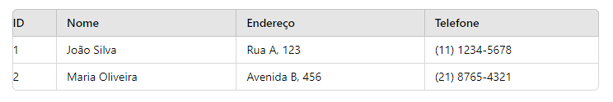

# Aula 01 - Banco de Dados

<!--  -->

## O que é um banco de dados?

O banco de dados é a organização e armazenagem de informações sobre um domínio específico. De forma mais simples, é o agrupamento de dados que tratam do mesmo assunto, e que precisam ser armazenados para segurança ou conferência futura. 

É comum que empresas tenham diversas informações que precisam ser organizadas e disponibilizadas dentro do negócio para que sejam consultadas posteriormente pela equipe e pela gerência.

Por isso, é interessante ter um sistema de gerenciamento de banco de dados, SGBD, para conseguir manipular as informações e tornar a rotina da empresa muito mais simples.

Hoje, existem diversos tipos de SGBDs, e cada um é adequado para uma necessidade dos clientes. São os mais comuns: Oracle, DB2, MySQL, SQL Server, PostgreSQL e outros.

## Tipo de Dados

- Estruturados
- Semi Estruturados
- Não Estruturados

 ## Estrutura de um Banco de Dados

- Tabela	
- Registro
- Campo

## Sistema Gerenciador de Banco de Dados (SGBD)

É um software que fornece uma interface para criar, gerenciar e manipular bancos de dados. O SGBD é responsável por facilitar as operações de armazenamento, recuperação, atualização e administração dos dados em um banco de dados, garantindo a segurança, integridade e eficiência no gerenciamento dos dados.

 
