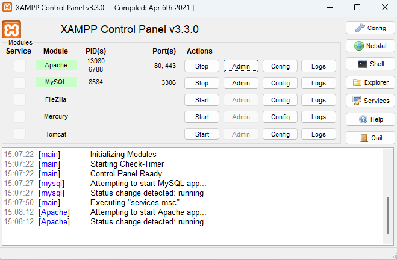
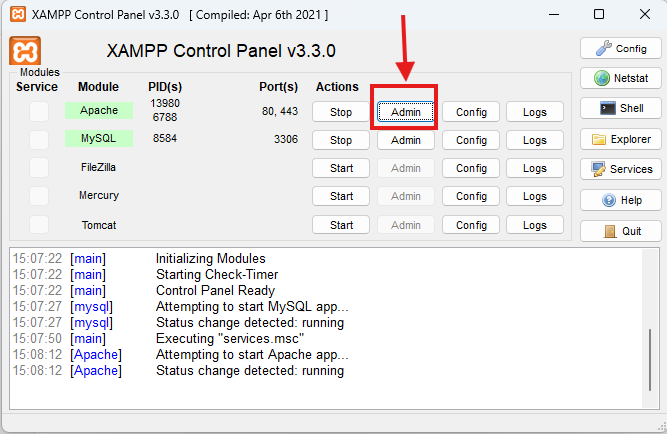
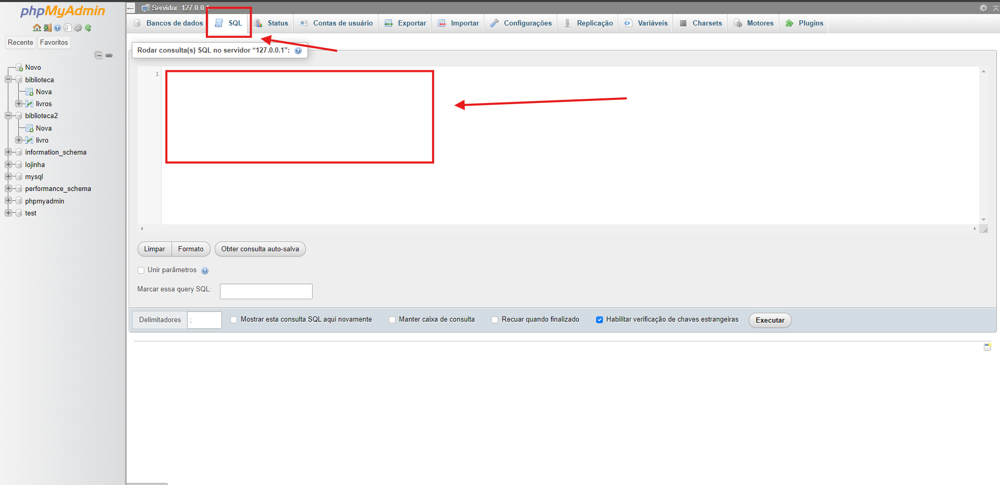
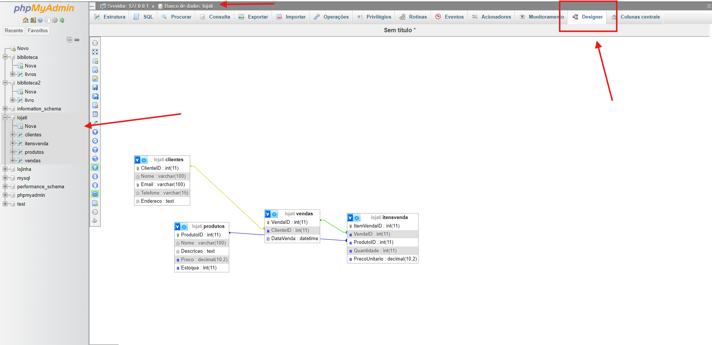

Link do Meet: https://meet.google.com/iua-orao-yqj

<div align = "center">

</div>

# Aula 04 - Criando Banco e Selects

## Criando Scripts

AGora feito o exemplo abaixo vamos cadastrar o banco de dados através do Script

Criar o arquivo <b>Script.sql</b> no visual Studio

### Agora vamos montar o arquivo para o banco de dados Loja

```sql
-- Criação do banco de dados
CREATE DATABASE LojaTI;
USE LojaTI;

-- Criação da tabela de Clientes
CREATE TABLE Clientes (
    ClienteID INT AUTO_INCREMENT PRIMARY KEY,
    Nome VARCHAR(100) NOT NULL,
    Email VARCHAR(100) UNIQUE NOT NULL,
    Telefone VARCHAR(15),
    Endereco TEXT
);

-- Criação da tabela de Produtos
CREATE TABLE Produtos (
    ProdutoID INT AUTO_INCREMENT PRIMARY KEY,
    Nome VARCHAR(100) NOT NULL,
    Descricao TEXT,
    Preco DECIMAL(10, 2) NOT NULL,
    Estoque INT DEFAULT 0
);

-- Criação da tabela de Vendas
CREATE TABLE Vendas (
    VendaID INT AUTO_INCREMENT PRIMARY KEY,
    ClienteID INT,
    DataVenda DATETIME DEFAULT CURRENT_TIMESTAMP,
    FOREIGN KEY (ClienteID) REFERENCES Clientes(ClienteID)
);

-- Criação da tabela de ItensVenda
CREATE TABLE ItensVenda (
    ItemVendaID INT AUTO_INCREMENT PRIMARY KEY,
    VendaID INT,
    ProdutoID INT,
    Quantidade INT NOT NULL,
    PrecoUnitario DECIMAL(10, 2) NOT NULL,
    FOREIGN KEY (VendaID) REFERENCES Vendas(VendaID),
    FOREIGN KEY (ProdutoID) REFERENCES Produtos(ProdutoID)
);

-- Inserção de dados na tabela de Clientes
INSERT INTO Clientes (Nome, Email, Telefone, Endereco) VALUES
('João da Silva', 'joao.silva@example.com', '1234-5678', 'Rua A, 123'),
('Maria Oliveira', 'maria.oliveira@example.com', '8765-4321', 'Avenida B, 456'),
('Carlos Souza', 'carlos.souza@example.com', '2345-6789', 'Rua C, 789'),
('Ana Lima', 'ana.lima@example.com', '3456-7890', 'Avenida D, 101'),
('Felipe Costa', 'felipe.costa@example.com', '4567-8901', 'Rua E, 202');

-- Inserção de dados na tabela de Produtos
INSERT INTO Produtos (Nome, Descricao, Preco, Estoque) VALUES
('Notebook Gamer', 'Notebook com placa de vídeo dedicada', 4999.99, 10),
('Mouse Ergonômico', 'Mouse com design ergonômico', 129.99, 50),
('Teclado Mecânico', 'Teclado mecânico com retroiluminação', 299.99, 30),
('Monitor 24" Full HD', 'Monitor de 24 polegadas com resolução Full HD', 799.99, 15),
('SSD 1TB', 'Disco SSD com capacidade de 1TB', 399.99, 25);

-- Inserção de dados na tabela de Vendas
INSERT INTO Vendas (ClienteID, DataVenda) VALUES
(1, '2024-08-25 14:30:00'),
(2, '2024-08-26 09:15:00'),
(3, '2024-08-27 11:45:00'),
(4, '2024-08-27 16:00:00'),
(5, '2024-08-28 10:30:00');

-- Inserção de dados na tabela de ItensVenda
INSERT INTO ItensVenda (VendaID, ProdutoID, Quantidade, PrecoUnitario) VALUES
(1, 1, 1, 4999.99),
(1, 2, 2, 129.99),
(2, 3, 1, 299.99),
(2, 4, 1, 799.99),
(3, 5, 1, 399.99),
(4, 2, 3, 129.99),
(4, 4, 1, 799.99),
(5, 3, 1, 299.99),
(5, 5, 2, 399.99);


```

## Usando o PHP MyAdmin
Vamos utilizar o PHP My Admin para fazer o banco, inicialmente vamos ativar no XAMPP os seguintes caminhos



Após isso vamos clicar no admin listado na imagem abaixo




Na Tela seguinte vamos procurar a seguinte opção




Neste campo vamos colar nosso Script


## Vendo os dados criados



# Consultas SQL para a Loja de TI

### Listar todos os Clientes
```sql
SELECT * FROM Clientes;
```

### Encontrar um cliente pelo nome
```sql
SELECT * FROM Clientes
WHERE Nome = 'João da Silva';
```

### Listar todos os produtos em estoque com quantidade acima de 20

```sql
SELECT Nome, Estoque
FROM Produtos
WHERE Estoque > 20;
```

### Mostrar produtos com preços acima de R$ 200, ordenados pelo preço de forma decrescente

```sql
SELECT Nome, Preco
FROM Produtos
WHERE Preco > 200
ORDER BY Preco DESC;
```

### Listar todas as vendas realizadas em uma data específica, ordenadas pela data de venda
```sql
SELECT *
FROM Vendas
WHERE DATE(DataVenda) = '2024-08-25'
ORDER BY DataVenda;
```

Os Selects serão executado neste campo


