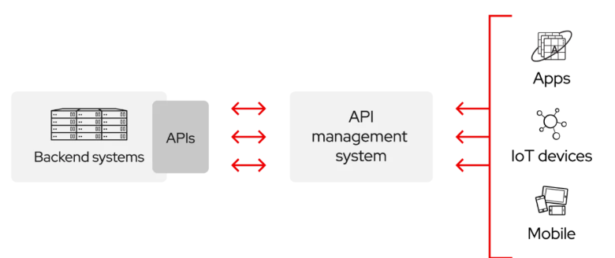
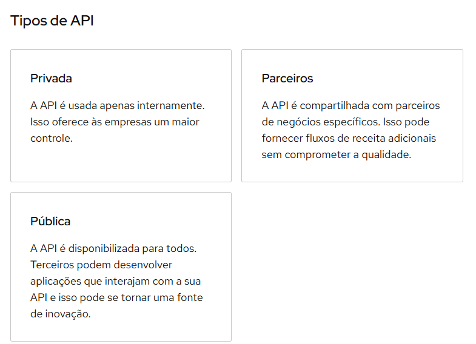

# Aula 13

- Link para a entrega: <a href="https://forms.gle/rsbPDqVP5wWAwwFW8">Entrega API Via CEP</a>

## API - Application Programming Interface
- As APIs são usadas para integrar novas aplicações com sistemas de software existentes. Isso aumenta a velocidade de desenvolvimento porque cada funcionalidade não precisa ser escrita do zero. Você pode usar APIs para aproveitar o código existente.

- Como as APIs funcionam?
Com as APIs, sua solução ou serviço podem se comunicar com outros produtos e serviços sem precisar saber como eles foram implementados. Isso simplifica o desenvolvimento de aplicações, gerando economia de tempo e dinheiro. Na hora de desenvolver suas novas ferramentas e soluções (ou ao gerenciar aquelas já existentes), as APIs oferecem a flexibilidade necessária para simplificar o design, a administração e o uso, além de trazer oportunidades de inovação.

- As APIs funcionam como se fossem contratos, com documentações que representam um acordo entre as partes interessadas. Se uma dessas partes enviar uma solicitação remota estruturada de uma forma específica, isso determinará como a aplicação da outra parte responderá.

## Vantagens de usar APIs
- As APIs simplificam a forma como os desenvolvedores integram novos componentes de aplicações a uma arquitetura preexistente. Por isso, elas ajudam na colaboração entre as empresas e as equipes de TI. Muitas vezes, as necessidades empresariais mudam rapidamente para responder aos mercados digitais em transformação. Nesse ambiente, novos concorrentes podem redefinir o setor inteiro com uma nova aplicação. Para manter a competitividade, é importante oferecer suporte à implantação e desenvolvimento rápidos de serviços inovadores. O desenvolvimento de aplicações nativas em nuvem é uma forma conhecida de aumentar a velocidade de criação. Ele depende de uma arquitetura de aplicações de microsserviços conectada por meio de APIs.

- As APIs são uma maneira simplificada de conectar a própria infraestrutura por meio do desenvolvimento de aplicações nativas em nuvem. No entanto, elas também possibilitam o compartilhamento de dados com clientes e outros usuários externos. As APIs públicas agregam valor de negócios porque simplificam e ampliam como você se conecta aos parceiros, além de, possivelmente, monetizar seus dados. Um exemplo famoso é a API do Google Maps.

