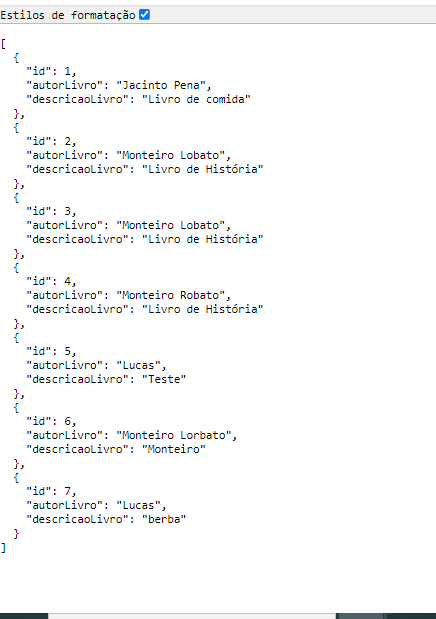

# Aula04

Link pra aula - Turma B - <a href="https://meet.google.com/ryg-zecj-xrb">Clique aqui</a>

## Relembrando os Verbos HTTP (GET e POST) - Projeto Lojinha "Aula 03"
Entendendo as diferenças sobre mandar um formulário usando "query" e utilizando o "body", quais as melhorias em comunicação com a API e o cliente.

## Verbos HTTP (GET e POST)
Trabalhando com o projeto **BIBLIOTECA** utilizaremos os verbos corretos **GET** para listar todos e **POST** para criar, para isso precisaremos da biblioteca body-parser.

## Conhecimentos NodeJS
- Biblioteca body-parser
- Redirecionamento de Páginas

Cole essa URL no google: http://localhost:3000/livros
para exibir a pagina abaixo: 



- SQL
```C
drop database if exists biblioteca;
create database biblioteca;
use biblioteca;

create table Livros(
    id integer primary key auto_increment,
    autorLivro varchar(252) not null,
    descricaoLivro varchar(252) not null
);

describe Livros;

insert into Livros (autorLivro, descricaoLivro) values
("Jacinto Pena","Livro de comida");
```
