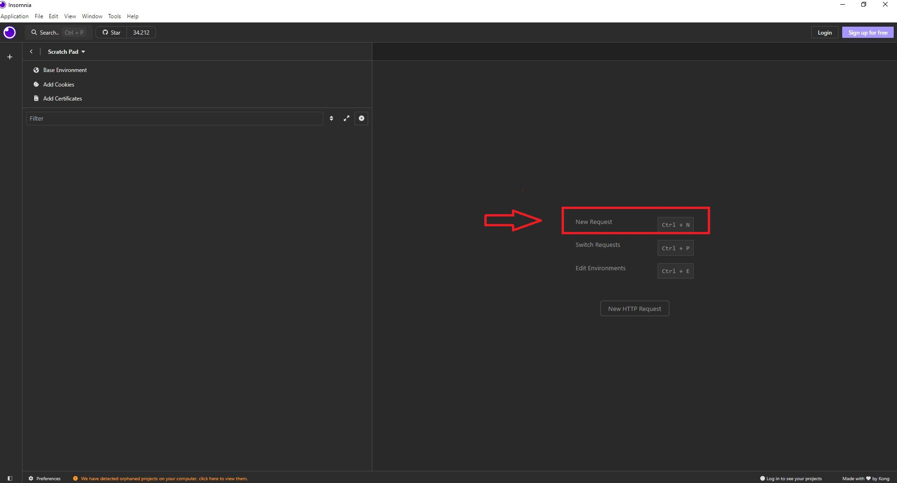
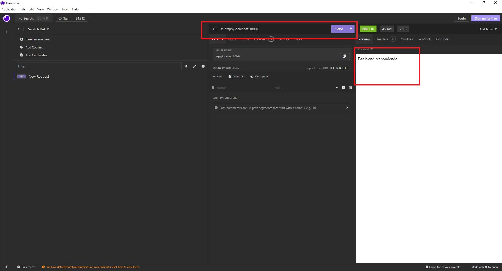

<div align = "center">


</div>


# Aula 05 - Realizando Testes No Insomnia

Vamos realizar testes fazendo testes no Insomnia

Primeiro vamos criar um banco de dados para uma loja TI, colocando apenas a tabela cliente e fazendo inserção de documentos

```sql
CREATE DATABASE LojaTI;
USE LojaTI;

-- Criação da tabela de Clientes
CREATE TABLE Clientes (
    ClienteID INT AUTO_INCREMENT PRIMARY KEY,
    Nome VARCHAR(100) NOT NULL,
    Email VARCHAR(100) UNIQUE NOT NULL,
    Telefone VARCHAR(15),
    Endereco VARCHAR(100)
);
INSERT INTO Clientes (Nome, Email, Telefone, Endereco) VALUES
('João da Silva', 'joao.silva@example.com', '1234-5678', 'Rua A, 123'),
('Maria Oliveira', 'maria.oliveira@example.com', '8765-4321', 'Avenida B, 456'),
('Carlos Souza', 'carlos.souza@example.com', '2345-6789', 'Rua C, 789'),
('Ana Lima', 'ana.lima@example.com', '3456-7890', 'Avenida D, 101'),
('Felipe Costa', 'felipe.costa@example.com', '4567-8901', 'Rua E, 202');

```
## Iniciando um novo projeto
- 1 Crie uma pasta chamada LojaTI
- 2 Abra com VsCode
- 3 Abra um terminal CMD e digite os comando a seguir
```bash
    npm init
```
Pressione enter várias vezes para deixar com configurações padrão
- 4 Instale as dependências iniciais
```bash
    npm i express cors mysql
```
Agora vamos criar o arquivo server.js

```javascript
const express = require("express");
const mysql = require("mysql");
const cors = require("cors");

const con = mysql.createConnection({
    user: 'root', 
    host: 'localhost',
    database: 'LojaTI'
});

// Conectar ao banco de dados
con.connect((err) => {
    if (err) {
        console.error('Erro ao conectar ao banco de dados:', err);
        return;
    }
    console.log('Conectado ao banco de dados.');
});

// Rota de teste
const teste = (req, res) => {
    res.send("Back-end respondendo");
}

// CRUD - Create
const create = (req, res) => {
    const { nome, email, telefone, endereco } = req.body; 
    
    const query = 'INSERT INTO Clientes (Nome, Email, Telefone, Endereco) VALUES (?, ?, ?, ?)';
    con.query(query, [nome, email, telefone, endereco], (err, result) => {
        if (err) {
            res.status(500).json({ error: err.message });
        } else {
            res.status(201).json({ message: 'Cliente criado com sucesso', result });
        }
    });
}

// CRUD - Read
const read = (req, res) => {
    con.query("SELECT * FROM Clientes", (err, result) => {
        if (err) {
            res.status(500).json({ error: err.message });
        } else {
            res.json(result);
        }
    });
}

// CRUD - Update
const update = (req, res) => {
    const { id, nome, email, telefone, endereco } = req.body;

    const query = 'UPDATE Clientes SET Nome = ?, Email = ?, Telefone = ?, Endereco = ? WHERE ClienteID = ?';
    con.query(query, [nome, email, telefone, endereco, id], (err, result) => {
        if (err) {
            res.status(500).json({ error: err.message });
        } else {
            res.json({ message: 'Cliente atualizado com sucesso', result });
        }
    });
}

// CRUD - Delete
const deleteClient = (req, res) => {
    const { id } = req.params;

    const query = 'DELETE FROM Clientes WHERE ClienteID = ?';
    con.query(query, [id], (err, result) => {
        if (err) {
            res.status(500).json({ error: err.message });
        } else {
            res.json({ message: 'Cliente removido com sucesso', result });
        }
    });
}

// Configurações de saída - FrontEnd
const app = express();
app.use(express.json());
app.use(cors());

// Rotas de Saída - FrontEnd
app.get("/", teste);
app.post("/clientes", create); 
app.get("/clientes", read);


// Teste e porta no console
app.listen(3000, () => {
    console.log("Servidor rodando na porta 3000");
});
```
Após criar o server.js, iniciar o mesmo através do código

```bash
node server.js
```


## Realizando testes no Insomnia



Após criar um novo basta colocar o link


