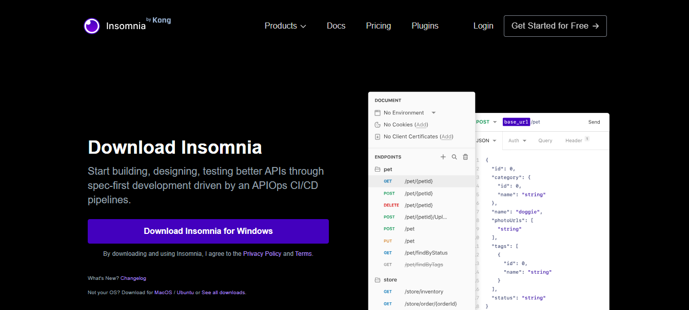
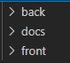

# Aula 06 

### Conhecendo o Insomnia.
- O que é o Insomnia?
    -  O insomnia é uma ferramenta de teste de API que permite aos desenvolvedores enviar requisições HTTP e gerenciar respostas.
  
- Essas requisições são, (GET, POST, PUT, DELETE) que ja viemos utilizando ao longo dessas 6 aulas.

### Passo a passo:
- Acesso o link <a href="https://insomnia.rest/download"><b>INSOMNIA</b></a> para realizar o download da ferramenta clicando em "DONWLOAD INSOMNIA FOR WINDOWS".
  
  
- Com o download concluído realize a instalação do software.


## Exercute o passo a passo abaixo:

### Projeto - Loja de TI

- Para darmos início iremos criar uma banco de dados para a loja de TI, colocando apenas a tabela **CLIENTE** e fazendo a inserção de informação.

#### SQL:
```C
CREATE DATABASE LojaTI;
USE LojaTI;

// -- Criação da tabela de Clientes
CREATE TABLE Clientes (
    ClienteID INT AUTO_INCREMENT PRIMARY KEY,
    Nome VARCHAR(100) NOT NULL,
    Email VARCHAR(100) UNIQUE NOT NULL,
    Telefone VARCHAR(15),
    Endereco VARCHAR(100)
);
INSERT INTO Clientes (Nome, Email, Telefone, Endereco) VALUES
('João da Silva', 'joao.silva@example.com', '1234-5678', 'Rua A, 123'),
('Maria Oliveira', 'maria.oliveira@example.com', '8765-4321', 'Avenida B, 456'),
('Carlos Souza', 'carlos.souza@example.com', '2345-6789', 'Rua C, 789'),
('Ana Lima', 'ana.lima@example.com', '3456-7890', 'Avenida D, 101'),
('Felipe Costa', 'felipe.costa@example.com', '4567-8901', 'Rua E, 202');

```

## Inciando um novo projeto
- Crie uma pasta em **documentos** chamada **Loja TI**.
- Abra essa pasta no VS Code.
- Dentro do VS Code, crie mais 3 pastas: 
  - BACK
  - FRONT
  - DOCS
  
    
- Abra o terminal e digite os seguintes comandos na pasta :
```
    cd back
    npm init
```
- Pressione ENTER até o final.
- Instale as dependências iniciais:
```
    npm i express
    npm i cors
    npm i mysql
```
## Agora criaremos juntos o arquivo server.js
```
// Dependências para rodar o servidor
const express = require ('express')
const cors = require('cors')
const routes = require("./src/routes")

//Configurações de saída - App -> Front ou Mobile
const app = express();
app.use(express.json());
app.use(cors());
app.use(routes);


// Rota para testar a API no console
app.listen(3000, ()=>{
    console.log('Servidor rodando na porta 3000')
})
```
